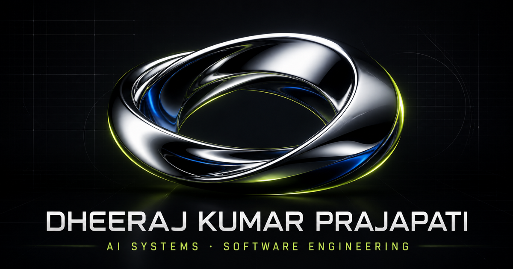

<p align="center">
  
</p>

<h1 align="center">Dheeraj Kumar Prajapati — Portfolio</h1>

<p align="center">
  AI systems, model evaluation, and human-centered software engineering.
</p>

<p align="center">
  <a href="https://premdheeraj.github.io/My-Portfolio/"><strong>View live portfolio ↗</strong></a>
  &nbsp;·&nbsp;
  <a href="mailto:pprajapati991@gmail.com">Email</a>
  &nbsp;·&nbsp;
  <a href="https://www.linkedin.com/in/dheeraj121">LinkedIn</a>
</p>

## Overview

An animated, responsive portfolio presenting my work across AI data training, model-output evaluation, debugging, and product engineering. The interface combines a real-time metallic Three.js scene with GSAP-driven motion and a crisp editorial layout.

## Featured work

- **COVID-19 Case Monitoring & Hospital Resource Prediction** — an AI-enabled healthcare application designed to connect patient signals with resource-demand planning.
- **Minerva** — source-grounded knowledge intelligence concept.
- **Odyssey** — multi-agent workflow orchestration concept.
- **Custorad** — human-in-the-loop customer intelligence concept.
- **Terminus** — reproducible code-evaluation and debugging concept.
- **TUN** — dataset and model-output quality network concept.

The five named AI systems are clearly identified on the site as concept/R&D directions, not shipped client products.

## Built with

- React + TypeScript
- GSAP + ScrollTrigger
- Three.js with physically based metallic materials
- Vite
- GitHub Actions + GitHub Pages

## Local development

```bash
npm install
npm run dev:github
```

Build the exact GitHub Pages output with:

```bash
npm run build:github
```

## Deployment

Every push to `main` builds the portfolio and deploys the static `dist` artifact through GitHub Pages.

---

<p align="center">Designed and engineered by Dheeraj Kumar Prajapati.</p>
